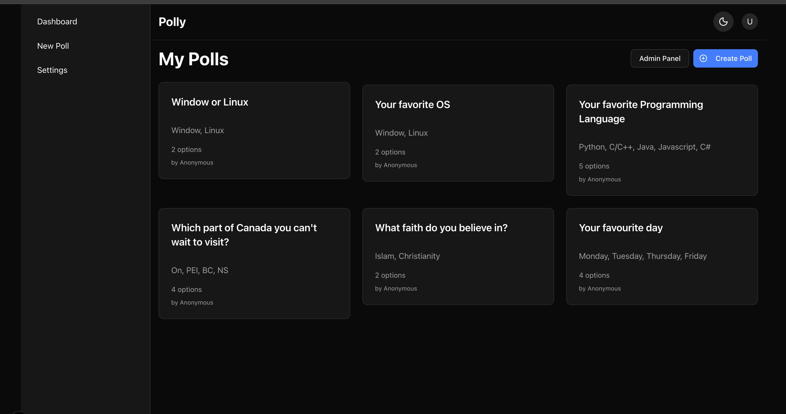

https://vote-app-umber.vercel.app/polls
# Polly – Real‑Time Polls with Next.js + Supabase

Polly is a full‑stack polling app where users create polls, vote, and view results. It uses RLS‑secured Supabase with role‑based access (admin vs user), a modern Next.js App Router UI, and a fully tested workflow.

## Demo


https://vote-app-umber.vercel.app/polls

## Features

- Authentication (email/PKCE via Supabase)
- Create/manage polls with options
- Vote and view results
- Share via QR code (mobile friendly)
- Dashboard with your polls and participation
- Admin role and panel (guarded): manage across polls
- Secure RLS policies with admin bypass helper
- Tests: unit + integration with Vitest and Testing Library

## Tech Stack

- Framework: Next.js 15 (App Router), React 18, TypeScript
- Backend: Supabase (PostgreSQL, RLS), @supabase/ssr
- Auth: @supabase/auth-helpers-nextjs
- UI: Tailwind CSS v4, shadcn/ui components, lucide-react icons, next-themes, sonner
- QR: qrcode
- Testing: Vitest, @testing-library/react, @testing-library/user-event, jsdom

## Architecture highlights

- App Router with server components and server actions
- Supabase SSR client for authenticated server data
- Strict RLS with public.is_admin(uid) helper for admin bypass
- Guarded routes: requireAuth and requireAdmin
- Clean separation of SSR queries vs client helpers

## Getting Started

Prerequisites:
- Node.js 18+ and npm
- A Supabase project

1) Clone

```bash
git clone https://github.com/Lawaltunde/alx-polly.git
cd alx-polly
```

2) Install

```bash
npm install
```

3) Configure environment

Create `.env.local` in the project root:

```bash
NEXT_PUBLIC_SUPABASE_URL=your-supabase-url
NEXT_PUBLIC_SUPABASE_ANON_KEY=your-supabase-anon-key
```

4) Initialize the database

Option A – via Supabase SQL editor (manual):
- Open Supabase Dashboard → SQL → run these in order:
    1. `supabase/migrations/001_initial_schema.sql`
    2. `supabase/migrations/002_roles.sql`
    3. `supabase/migrations/003_admin_policies.sql`
    4. Remaining files in `supabase/migrations/` as needed

Option B – via Supabase CLI (if configured):

```bash
# From the repo root (requires supabase CLI and a linked project)
supabase db reset
```

5) Promote an admin (so the Admin Panel becomes visible)

In Supabase SQL editor, replace <USER_UUID> with your auth user id:

```sql
update public.profiles
set role = 'admin'
where id = '<USER_UUID>';

select id, role from public.profiles where id = '<USER_UUID>';
```

6) Run the app

```bash
npm run dev
```

Open http://localhost:3000

## Usage

- Create a poll: Dashboard → Create Poll
- Vote: Open a poll → select an option → Vote
- Share: Use the QR code button on a poll
- Admin Panel: As admin, visit /polls and click “Admin Panel” (or go to /admin)

## Scripts

- Dev: `npm run dev`
- Build: `npm run build`
- Start: `npm start`
- Test: `npm test`
- Test (watch/UI/coverage): `npm run test:watch` | `npm run test:ui` | `npm run test:coverage`

## Testing

```bash
npm test
```

Vitest runs unit and integration tests (Polling pages, admin actions, UI components). Test helpers stub Next.js routing and Supabase clients.

## Deployment

- Vercel is recommended for Next.js. Set env vars (URL and anon key) in your project settings.
- Ensure migrations are applied to the production database before first run.

## Troubleshooting

- Admin button not visible: ensure `profiles.role = 'admin'` for your user, then log out/in and refresh `/polls`.
- RLS errors: confirm all migrations ran (001 → latest) and your session is authenticated.
- Tests failing resolving `server-only`: test config aliases it; run tests via `npm test`.

---

Made with Next.js + Supabase. Contributions and issues are welcome.